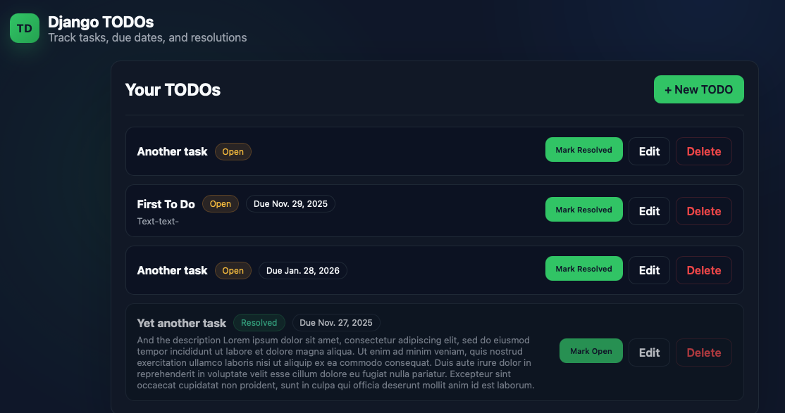

# AIDev_ZoomCamp

## Assignment_1: Django TODO app

### Setup
1) Create env (if using conda): `conda create -n django python=3.11 django`
2) Activate (if using conda): `conda activate django`
3) From `Assignment_1/`:
   - Run migrations: `python manage.py migrate`
   - Start server: `python manage.py runserver`

### App features
- Create, edit, delete TODOs
- Due dates and completion toggle
- Basic styling and admin registration

### Tests
- Run: `python manage.py test`

## Screenshot

